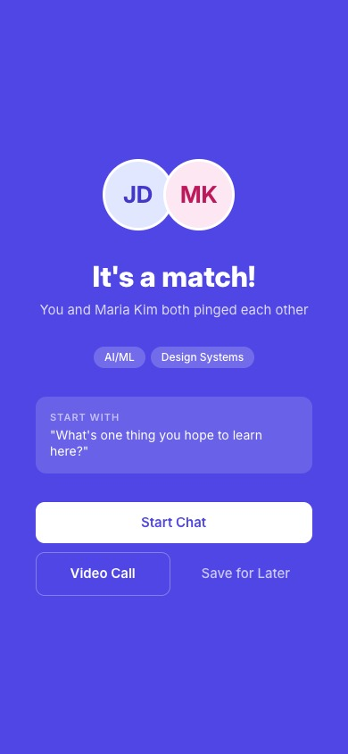

# Hybrid Presence Layer — Product Narrative

**Audience:** Hackathon jurors, challenge giver, and anyone who needs to tell the story (PMs, organizers, sponsors).  
**Objective:** Capture the problem, product flow, signature moment, and org-level metrics so the eventual PDF answers the most common questions without forcing a live demo.

---

## 1. The Dual-World Problem

Hybride Events heute liefern zwei parallel laufende Experiences: ein chaotischer On-Site-Floor und ein isolierter Remote-Stream. Teilnehmer fühlen sich entweder gedruckt in einer überfüllten Halle oder als passive Beobachter. Die fehlende Brücke mindert “Weak Tie”-Verbindungen, die eigentlich den größten Mehrwert heben.

**Insight:** Die wertvollste Energie entsteht nicht auf der Bühne, sondern im Raum dazwischen — auf den Fluren, in den Kaffeepausen, in der Energie direkt nach einem Talk. Die Hybrid Presence Layer (HPL) baut diesen sozialen Layer in den Event-Flow ein.

---

## 2. Story über das Produkt

### 2.1 20-Sekunden-Flow

1. **RIGHT NOW (Presence Feed)** – statt einer Namenliste zeigt HPL einzelne Personen mit Kontext.  
2. **Session Context** – man sieht, wer gerade beim selben Talk ist, inkl. Shared Context Tags.  
3. **Mutual Match** – Algorithmisch relevante Matches sichern, dass Gespräche einen Purpose haben.  
4. **3-Min Call** – automatisches, gekürztes Video-Meet nach einer Match-Bestätigung.

  
*Jede Karte in RIGHT NOW zeigt, wen du ansprechen könntest, warum (shared interest + shared context) und wie du sie direkt pingst.*

  
*In der “People You Might Want to Meet”-Liste steckt der Übergang aus dem Talk in eine Verbindung.*

  
*Match-Qualität > 35 %; das Match basiert auf Kontext-Intelligenz und erlaubt ein kuratiertes Gespräch.*

  
*Ein vertikaler, 3-minütiger Call ersetzt den “Zoom-Link anfragen”-Moment mit einer fokussierten Runde.*

### 2.2 Onboarding in 60 Sekunden

- Magic Link → Teilnehmer wählt “vor Ort” oder “remote”.  
- Typ wählen + 3 Interessen → sofort relevante Vorschläge.  
- Optionaler Icebreaker (anstatt eines leeren Profils) hält das Gespräch warm.  
- Keine Passwörter, keine App Stores, kein Download.  

Das Onboarding reduziert Friction: Jede Sekunde Verzögerung senkt die Aktivierung.

---

## 3. Experience-Details

### 3.1 Presence Feed (RIGHT NOW)

- Hero-Element ist keine Teilnehmerliste, sondern “Right Now”: drei Personen mit Kontext, Ping-Button und Status.  
- Unter dem Hero liegt der Feed mit filtern, Live-Status, Filtern nach Session/Booth.  
- Sichtbarkeit über alle Rollen: remote Teilnehmer sehen denselben Feed wie On-Site, aber mit Status “Im Raum” oder “Remote”.  
- Frage beantwortet: “Wen sollte ich jetzt ansprechen?”

### 3.2 Booth-Erlebnis

- Physical & Remote besuchen denselben Booth, Lead-Capture ist synchronisiert.  
- Staff kann proaktiv reagieren (z. B. “Booth Boosten”-Button).  
- Booths werden vorgeschlagen, basierend auf Kontext (Interessen + Session).  
- Sponsoren sehen ROI: Leads und Session-Trigger werden live sichtbar gemacht.

### 3.3 Check-in & Kontext

1. Eintritt via Link oder QR; Teilnehmer signalisiert “vor Ort” oder “Remote”.  
2. Session-Check-in: QR am Raum oder Tap auf “I'm here/Join”.  
3. Booth-Besuch: QR oder Klick.  
4. Live-Status: Available, In Session, At Booth, Busy, Away.  

Die Plattform speichert **Kontext statt GPS** (Session, Booth, Teilnehmer-Typ, Dauer). Das Dashboard zeigt, wer wo ist, wie viele aktiv sind und welche Sessions Booth-Besuche ausgelöst haben.  

### 3.4 Organizer Dashboard

- Echtzeit-Übersicht zu aktiven Teilnehmern und Interaktionen.  
- Cross-Pollination als zentrale KPI: wie viele On-Site ↔ Remote-Verbindungen entstehen.  
- Tools zur Wellen-Auslösung (Booth-Push, Session Highlight).  
- Sitzungsdetails und Sponsoren-ROI werden nachverfolgbar gemacht.

Pilot-Metriken:  
| Metrik | Ziel |  
| --- | --- |  
| Aktivierung | > 60 % |  
| Zeit bis erste Interaktion | < 10 Min. |  
| Match-Qualität | > 35 % |  
| Cross-Pollination | > 15 % |

---

## 4. Signature Moment — das 15-Minuten-Fenster nach dem Talk

Dieses Fenster ist horizontal im Slide deck schwer sichtbar, daher das Doc:  
| Phase | Was passiert |  
| --- | --- |  
| +0 min | Publikum leave talk, HPL blendet “People You Might Want to Meet” ein. |  
| +2 min | Contextual Matches aus RIGHT NOW → “It’s a Match”-Cards. |  
| +5 min | Einladung zum 3-min Call, Inline-Anleitung (Hand heben, Kamera bereit). |  
| +10 min | Falls Gespräch nicht klappt, Remindern für “Coffee chat + follow-up”. |  
| +15 min | Window schließt, Status wechselt; neue Sessions beginnen. |

Diese vertikale Story (Feed → Match → Call) zeigt, wie HPL aus der Content-Demonstration eine Verbindung macht. Nutze Annotated Calls-to-Action (CTA) und Callout sicherstellen, dass Zuschauer den Flow sehen.

---

## 5. Anticipated Questions

| # | Frage | Antwort |  
| --- | --- | --- |  
| 1 | Was ist das Problem? | Zwei parallele Welten, fehlender sozialer Layer. Die Doku zeigt, wie RIGHT NOW & 15-Minuten Window den Gap schließen. |  
| 2 | Wer sind unsere Zielnutzer? | Teilnehmer, Organisatoren, Sponsoren; jede Rolle bekommt ein eigenes Interface (Feed, Dashboard, Booth Tools). |  
| 3 | Wie sieht das Onboarding aus? | Magic Link, Typ, 3 Tags, optionaler Icebreaker; kein Passwort, kein Download. |  
| 4 | Was macht RIGHT NOW? | Visuelle Personenkarte, Kontext-Tag, Ping. Visueller Feed beantwortet direkt: Wer ist jetzt relevant? |  
| 5 | Wie wird Matching definiert? | Shared interests + session context + mutual opt-in; Zielqualität > 35 %. |  
| 6 | Was passiert nach dem Match? | 3-min Call, Conversation Starter, leichte Kamera-Vorbereitung. |  
| 7 | Wie lange dauert die Aktivierung? | < 10 Minuten bis zur ersten Interaktion. |  
| 8 | Wie wird der 15-Minuten-Call sichtbar gemacht? | Vertikale Card + timeline (doc section) mit CTA, Status-Ampeln. |  
| 9 | Was passiert, wenn kein Call zustande kommt? | Follow-up Reminder + Vorschlag alternativer Gespräche. |  
| 10 | Wie werden Remote und On-Site synchronisiert? | Gleiches Feedmodell; Status unterscheidet “Im Raum” vs. “Remote”, aber Boho & Match flows sind identisch. |  
| 11 | Was zeigt das Organizer Dashboard? | Aktive Teilnehmer, Cross-Pollination, Booth-Performance, ROI. |  
| 12 | Wie werden Booths gepusht? | Organizer Push-Kampagnen, Highlight-CTA, Live Lead-Capture. |  
| 13 | Was ist der Datenfokus? | Kontext (Session, Booth, Teilnehmer-Typ, Dauer); keine permanente Ortung. |  
| 14 | Wie messen wir Erfolg? | Aktivierung > 60 %, Match > 35 %, Cross-Pollination > 15 %. |  
| 15 | Wie wird Sponsor-ROI dokumentiert? | Booth Visits + Session Trigger im Dashboard, synchron für remote + vor Ort. |  
| 16 | Wie skaliert Check-in? | QR oder Tap am Raum, automatisiertes Live-Statustracking. |  
| 17 | Welche Sicherheit/Privatsphäre gibt es? | Nur aktive Check-ins speichern Kontext; Zugriff streng auf Event-Team. |  
| 18 | Gibt es Monitoring für Sessions? | Ja, Dashboard zeigt später, welche Sessions Booth-Besuche gebracht haben. |  
| 19 | Wie liefern wir den “Signature Moment” im Deck? | Das Doc empfiehlt Fokus-Slide mit timeline & annotated CTA, ersetzt trockenen Text. |  
| 20 | Was ist der nächste Schritt? | PDF-Doc + annotated MVP-Video (Paper MCP) + Invite zu Demo. |

---

## 6. Technical + Process Notes

- **Screenshot Assets:** `../paper-presence-feed.jpg`, `../paper-session-detail.jpg`, `../paper-mutual-match.jpg`, `../paper-video-call.jpg` (sie stecken im Paper MCP).  
- **Layout Guidance:** Der Signature Moment braucht ein verankertes Vertical-Flow-Visual – evtl. durch drei Screens stacked mit Beschriftung “15-Minuten-Fenster”.  
- **PDF Tooling:** Markdown → PDF via `pandoc docs/hybrid-presence-layer.md -o docs/hybrid-presence-layer.pdf` (oder `slidev export --format=pdf` falls visuelle Deck-Render gewünscht).  
- **Next Steps:**  
 1. Review Story with Product Team + integrate any missing metrics/questions.  
 2. Embed annotated screenshots (Figma/Slidev) if we want “rich juice” for judges.  
 3. Run PDF build, hand off final asset.
