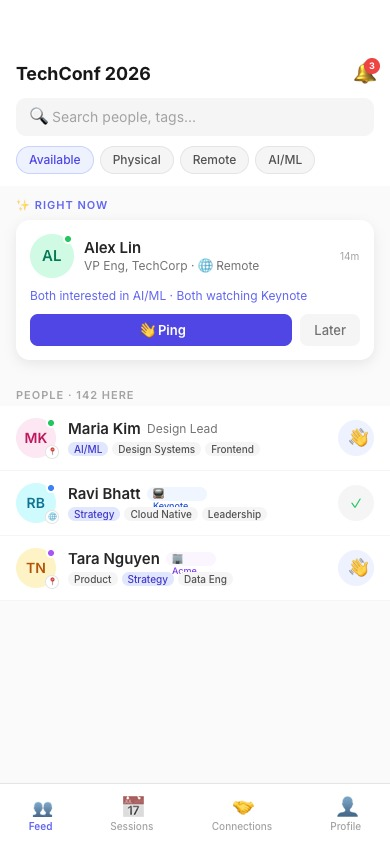
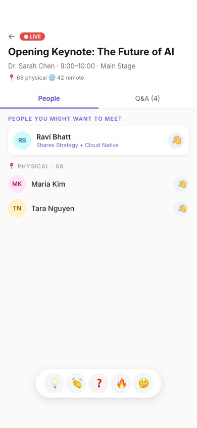
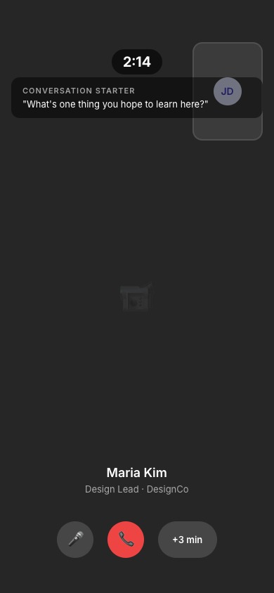

# Hybrid Presence Layer

Die soziale Schicht für hybride Events

  
    Ein Raum, nicht zwei Bildschirme
  

  Rick · März 2026

---
layout: center
class: text-center
---

# Das Problem

Hybride Events schaffen zwei getrennte Welten.

  

    
VOR ORT

    
Zu viele Menschen. Zu wenig Orientierung.

    
Networking ist Zufall. Die richtigen Leute sind im Raum, aber schwer greifbar.

  

  

    
REMOTE

    
Sichtbar während des Streams, unsichtbar danach.

    
Streaming ja, soziale Teilnahme nein. Der Browser schliesst, der Moment ist weg.

  

Der Bruch passiert immer direkt nach dem Talk.

---
layout: center
class: text-center
---

# Die Erkenntnis

  Flurgespräche sind der wertvollste Teil jeder Konferenz.

Was fehlt, ist nicht noch mehr Content. Es fehlt ein sozialer Layer.

  
Der Produkt-Moment

  

    Direkt nach einer Session ist der gemeinsame Kontext am stärksten. Genau dort muss Hybrid von Information zu Verbindung wechseln.
  

---
layout: center
class: text-center
---

# Die Idee

Drei Schichten, eine Plattform — kein neues Event-Tool, sondern die fehlende Verbindung dazwischen.

  

    
INTERACTION LAYER

    
Ping, Chat, 3-Minuten-Videocall

  

  

    
CONNECTION ENGINE

    
Wer sollte wen treffen — genau jetzt

  

  

    
PRESENCE LAYER

    
Wer ist hier, wo, und was macht diese Person gerade

  

Wir sind kein Streaming-Tool, kein Chat, kein CRM. Wir sind die Schicht, die aus Anwesenheit Begegnung macht.

---

# Der Flow

Vom Link zum Gespräch in unter 3 Minuten.

  

    
    
1. PRESENCE FEED

    
Wer ist jetzt relevant?

  

  

    
    
2. SESSION KONTEXT

    
Gleicher Talk, gleicher Moment

  

  

    
    
3. IT'S A MATCH

    
Beidseitiges Interesse

  

  

    
    
4. 3-MIN CALL

    
Sofort ins Gespräch

  

  Vom Passivsein zum
  Verbinden

---

# Was heute funktioniert

Gebaut und (teilweise) lauffähig — kein Mockup.

  

    

      
Magic-Link-Auth & Onboarding

      
Kein Passwort. Link klicken, Typ wählen, 3 Tags, drin. Unter 60 Sekunden.

    

    

      
Ping → Match → Chat

      
Echtzeit-Updates via WebSockets. Filtert nach Typ, Status und Interessen.

    

    

      
Ping → Match → Chat

      
Ein Tap. Gegenseitiges Interesse. Sofort im Gespräch. Echtzeit via Broadcasting.

    

    

      
Sessions mit Check-in & Reaktionen

      
QR-Check-in, Live-Reaktionen, Q&A mit Voting, Post-Session-Connections.

    

  

  

    

      
Discovery Engine

      
Matching-Algorithmus mit Scoring, gewichteten Interessen und Session-Kontext.

    

    

      
Booths mit Lead-Capture

      
Virtuelle Booths, Besucherhistorie, Staff-Tools. Physical und Remote gleich.

    

    

      
Organizer-Dashboard

      
Live-KPIs, Teilnehmermanagement.

    

    

      
Videocall-Signaling

      
WebRTC-Raum-Generierung, Server-Side-Signaling. Peer-to-Peer ready.

    

  

20+ Models · 30+ Controllers · Full Test Suite · Komplett auf Deutsch lokalisiert

---

# Was noch fehlt

Ehrlich: das ist ein Hackathon-MVP. Hier sind die Lücken.

  

    
PWA-Shell

    
Manifest und Service Worker existieren, aber Offline-Support und Push-Notifications sind noch nicht produktionsreif.

  

  

    
Video-Calls (WebRTC)

    
Signaling steht. Peer-to-Peer-Verbindung funktioniert lokal, braucht aber TURN-Server für Produktion.

  

  

    
Smart Notifications

    
In-App-Notifications funktionieren. Push, Batching und Frequency Limits fehlen noch.

  

  

    
Serendipity Mode

    
Der Matching-Algorithmus priorisiert Relevanz. Die bewusste Cross-Discipline-Logik ist konzipiert, aber nicht implementiert.

  

  

    
Post-Event Export

    
Connections werden gespeichert. Export als vCard oder CSV und Follow-up-Nudges fehlen.

  

  

    
Skalierung

    
Getestet mit Seed-Daten. Nicht lastgetestet für 500+ gleichzeitige WebSocket-Verbindungen.

  

---

# Wohin das führt

Vom Hackathon-Prototyp zur Plattform.

  

    
PHASE 1 — PILOT

    

      
Ein reales Event, 50–200 Teilnehmende

      
PWA produktionsreif machen

      
Push Notifications

      
Video-Calls stabilisieren

    

  

  

    
PHASE 2 — VALIDIERUNG

    

      
Cross-Pollination messen

      
Serendipity Mode aktivieren

      
Sponsor-ROI Dashboard

      
Multi-Event Support

    

  

  

    
PHASE 3 — PLATTFORM

    

      
API für Event-Tool-Integration

      
AI Conversation Starters

      
Interaction Graph Analytics

      
Cross-Event Identity

    

  

  

    Die Kernfrage: Entsteht durch diesen Layer tatsächlich Verbindung, die sonst nicht passiert wäre?
  

  
Das lässt sich nur mit einem echten Pilot beantworten.

---
layout: center
class: text-center
---

# Wie das gebaut wurde

Ein Entwickler. KI-gestützt. Drei Wochen.

  

    
20+

    
Models

  

  

    
30+

    
Controllers

  

  

    
20+

    
Vue Pages

  

  

    
RT

    
WebSockets

  

Laravel 13 · Inertia v3 · Vue 3 · Tailwind v4 · Reverb · Pest · PWA

---
layout: center
class: text-center
---

# Danke

Fragen? Demo? Zusammenarbeit?

  
riccardo.previti@uoiea.ch

  
github.com/Verickt/hybridpresencelayer

  
    Hybrid Presence Layer
  

